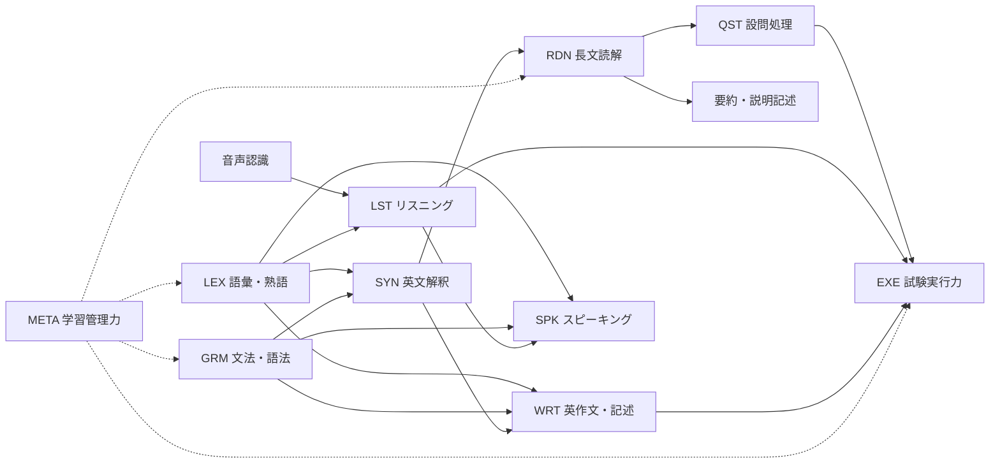

# 大学受験英語 能力マップ

## 1. 全体構造

大学受験英語を10領域に分けます。

基礎領域の不足は上位領域へ波及します。ただし、すべての生徒が語彙からやり直すとは限りません。診断により主要なボトルネックを特定します。

## 2. LEX: 語彙・熟語

| 下位能力 | 測定対象 |
| --- | --- |
| LEX-01 基本語義 | 頻出する中心的な意味を即答できる |
| LEX-02 文脈語義 | 文脈に応じて適切な意味を選べる |
| LEX-03 多義語 | 同じ単語の異なる用法を区別できる |
| LEX-04 派生語 | 品詞変化、接頭辞、接尾辞を処理できる |
| LEX-05 コロケーション | 自然な語の結びつきを認識できる |
| LEX-06 熟語・句動詞 | 複数語を一まとまりとして認識できる |
| LEX-07 認識速度 | 意味を思い出すために長く停止しない |
| LEX-08 音声対応 | 綴り、発音、意味を結びつけられる |

測定候補: 正答率、回答時間、翌日再現率、1週間後再現率、文中での正答率。

## 3. GRM: 文法・語法

| 下位能力 | 測定対象 |
| --- | --- |
| GRM-01 品詞・文型 | 語の役割と基本文型を判断する |
| GRM-02 時制・相 | 時間関係と完了・進行の意味を理解する |
| GRM-03 助動詞 | 推量、義務、可能性などを区別する |
| GRM-04 準動詞 | 不定詞、動名詞、分詞の働きを判断する |
| GRM-05 関係詞 | 修飾先と節の欠落要素を確認する |
| GRM-06 接続表現 | 節と節の論理関係を判断する |
| GRM-07 仮定法 | 事実との距離や反実仮想を理解する |
| GRM-08 比較・否定 | 比較構文と否定範囲を処理する |
| GRM-09 一致・語順 | 一致、倒置、省略、強調を認識する |
| GRM-10 語法 | 動詞、目的語、前置詞の組み合わせを扱う |
| GRM-11 文中運用 | 単独問題の知識を長文理解へ使える |

文法選択問題と長文内での運用能力は別に測定します。

## 4. SYN: 英文解釈・構文解析

| 下位能力 | 測定対象 |
| --- | --- |
| SYN-01 骨格特定 | 主語、述語動詞、目的語、補語を特定する |
| SYN-02 境界認識 | 節と句の開始・終了を判断する |
| SYN-03 修飾関係 | 修飾語と被修飾語を結びつける |
| SYN-04 指示関係 | 代名詞・指示語の参照先を特定する |
| SYN-05 特殊構文 | 省略、挿入、倒置、同格を復元する |
| SYN-06 意味保持 | 文構造に沿って意味の抜けなく理解する |
| SYN-07 和訳表現 | 原文の意味を自然で正確な日本語へ変換する |

測定候補: 構造説明の正確さ、意味要素の欠落、誤訳原因、処理時間。

## 5. RDN: 長文読解

| 下位能力 | 測定対象 |
| --- | --- |
| RDN-01 文理解 | 一文ごとの命題を正確に取る |
| RDN-02 段落理解 | 主張、理由、具体例、結論を区別する |
| RDN-03 論理関係 | 逆接、因果、対比、追加、言い換えを追う |
| RDN-04 指示解決 | 文をまたぐ指示内容を特定する |
| RDN-05 要旨把握 | 文章全体の中心主張を特定する |
| RDN-06 推論 | 根拠から明示されていない結論を導く |
| RDN-07 情報検索 | 必要な根拠箇所へ戻れる |
| RDN-08 図表統合 | 本文と図、表、広告、複数資料を統合する |
| RDN-09 読解速度 | 理解度を維持しながら時間内に読む |
| RDN-10 持続性 | 複数長文でも理解精度を維持する |

速度はWPMだけで評価せず、制限時間内の理解度と組み合わせます。

## 6. QST: 設問処理

| 下位能力 | 測定対象 |
| --- | --- |
| QST-01 要求理解 | 設問が何を求めているか特定する |
| QST-02 根拠特定 | 本文の根拠箇所を示す |
| QST-03 言い換え | 正解選択肢のパラフレーズを認識する |
| QST-04 誤答排除 | 過剰、部分一致、本文外情報を見抜く |
| QST-05 形式対応 | 内容一致、空所、整序、要旨、推論を解き分ける |
| QST-06 記述要件 | 必要要素、字数、表現条件を満たす |
| QST-07 保留判断 | 解けない問題を適切に保留する |

本文理解の失敗と、理解後の選択・記述の失敗を分離します。

## 7. LST: リスニング

| 下位能力 | 測定対象 |
| --- | --- |
| LST-01 音素識別 | 類似する音を区別する |
| LST-02 音声変化 | 連結、弱化、脱落を処理する |
| LST-03 語彙認識 | 知っている語を音から認識する |
| LST-04 意味保持 | 意味のまとまりを作業記憶に保持する |
| LST-05 意図推論 | 話者の目的、態度、含意を判断する |
| LST-06 情報抽出 | 数字、固有名詞、条件を聞き取る |
| LST-07 資料統合 | 会話と図表・選択肢を結びつける |
| LST-08 先読み | 放送前に設問と選択肢を整理する |
| LST-09 メモ | 必要情報だけを記録する |
| LST-10 一回読み | 聞き直せない条件で判断する |

文字で読めば理解できる場合は、語彙より音声認識を優先候補とします。

## 8. WRT: 英作文・記述

| 下位能力 | 測定対象 |
| --- | --- |
| WRT-01 文生成 | 文法的に成立する英文を作る |
| WRT-02 語彙選択 | 意味と語法に合う表現を選ぶ |
| WRT-03 和文変換 | 日本語を簡単な内容へ変換して英語にする |
| WRT-04 構成 | 主張、理由、具体例、結論を組み立てる |
| WRT-05 条件遵守 | 語数、論点、形式を守る |
| WRT-06 言い換え | 意味を保ちながら別表現にする |
| WRT-07 要約 | 主要情報を選び、圧縮する |
| WRT-08 自己点検 | 文法、綴り、論理を見直す |

自由英作文、和文英訳、要約、説明記述は別タスクとして評価します。

## 9. SPK: スピーキング

| 下位能力 | 測定対象 |
| --- | --- |
| SPK-01 明瞭性 | 発音・強勢・区切りにより意味が伝わる |
| SPK-02 流暢さ | 過度な停止なく発話を継続する |
| SPK-03 応答適合 | 質問や課題に直接答える |
| SPK-04 構成 | 主張、理由、具体例を口頭で組み立てる |
| SPK-05 相互作用 | 質問、確認、応答を通して対話を維持する |
| SPK-06 言語運用 | 語彙・文法を意味伝達に使う |
| SPK-07 修復 | 聞き返し、言い換え、自己訂正を行う |

発音の母語話者らしさではなく、理解可能性、課題達成、論理、相互作用を中心に評価します。

## 10. EXE: 試験実行力

- EXE-01 時間配分
- EXE-02 解答順序
- EXE-03 捨て問判断
- EXE-04 見直し方法
- EXE-05 マーク・転記管理
- EXE-06 集中維持
- EXE-07 下振れ時の立て直し
- EXE-08 本番環境への適応

時間無制限では取れるのに、本番形式で取れない場合の主要候補です。

## 11. META: 学習管理力

- META-01 間違い分類
- META-02 復習間隔
- META-03 再テスト
- META-04 教材完了管理
- META-05 計画量の調整
- META-06 学習記録
- META-07 睡眠・体調管理
- META-08 方法変更の判断

英語力そのものではありませんが、長期的な伸びと再現性を左右します。
